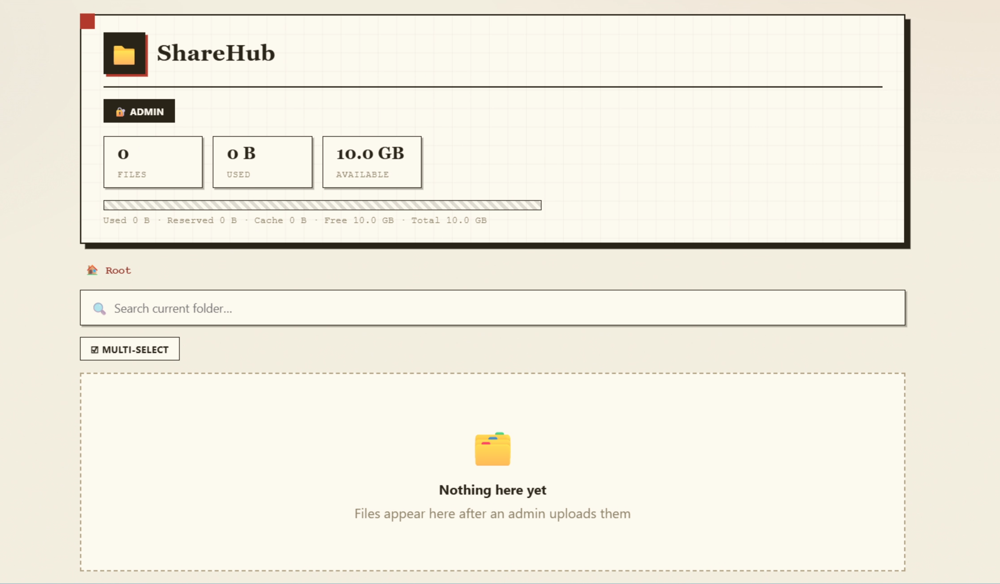
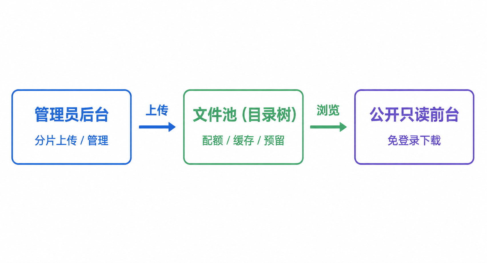

<div align="center">



# ShareHub · Self-hosted Resource Sharing Station

**Upload, share, done.**

[中文](./README.md)

</div>

---

## Table of Contents

- [What is this](#what-is-this)
- [Core Features](#core-features)
- [Other Features](#other-features)
- [Cache & Reservation](#cache--reservation-mechanism)
- [Comparison](#comparison)
- [Quick Start](#quick-start)
- [Usage](#usage)
- [License](#license)

## What is this

ShareHub is a lightweight self-hosted resource sharing station: an admin organizes files into a directory tree from the web UI, and visitors browse, search and download without any account.

No multi-user, no sync clients, no personal storage — just one thing: **the admin puts content up, visitors grab it via a link.** Great for course materials, research assets, team resource libraries, and asset distribution.



## Core Features

### 🎯 Folder-context upload
Clicking upload inside a folder sends files **only to that folder**. Switching folders mid-upload never redirects queued files — upload continuously while organizing elsewhere, with zero misplacement.

### 🔁 Resumable transfer
After a drop, tab close, or cancel, re-selecting the same file **re-uploads only the missing chunks**; files ≤64 MB can skip already-uploaded content by content hash.

### ⚖️ Quota reservation
Capacity is **reserved at init based on net delta** (overwriting an old file only reserves the difference), instead of failing after uploading. Reservations are reclaimed three ways: **cancel releases immediately, 2-minute idle auto-releases, tab close releases instantly**. Concurrent uploads never overshoot, and available space is always accurate.

### 📤 Upload & share
Once a file finishes uploading, it automatically appears in the public directory tree — visitors browse, search and download with no account and no extra publishing step.

## Other Features

### 📂 Folder mechanics
Drag-and-drop or pick whole folders; files queue in **ascending size order** (small first); duplicate folder names **merge** (same-name files overwrite, new files join).

### 📊 Real-time visualization
A four-segment capacity bar (used / reserved / cache / available) that always sums to the total; live per-status counters (total / done / uploading / waiting / paused / failed) during uploads; pagination with page-jumping on both file and task lists.

### ⚡ Chunked concurrent upload
Large files split into **5 MB chunks**, uploaded with **3-way concurrency**, each chunk verified with **SHA-256**. Fast, and never blocked by single-request size limits.

### 🛡️ Security
HMAC-signed cookies + sliding renewal + HttpOnly/SameSite; path traversal protection; per-chunk hash verification; all admin endpoints require login.

### 🐍 Single file · zero dependencies
The whole app is one `server-en.py` (Python standard library). No database, no Node, no PHP. Runs anywhere Python 3 exists.

## Cache & Reservation Mechanism

**Why "cache"?** Uploads are chunked: chunks land in a staging area first, then merge into the final file. Cancelled or interrupted chunks are **kept as cache** so re-uploading the same file can **resume**. The cache is auto-cleaned by a 10-minute TTL, and can also be managed manually via "view cache / clear cache".

**Why "reservation"?** Every file must pass a capacity check at init. To prevent concurrent uploads from each passing but exceeding the quota together, the server **reserves** capacity for each passed file (only the net delta for overwrites). Reservations are released three ways:

| Scenario | Reservation outcome |
|---|---|
| Upload completes | File enters the pool, reservation released |
| Cancel | Released immediately; chunks kept as cache (resumable) |
| Tab closed | Released instantly (sendBeacon) |
| Crash / network drop | Auto-released after 2-min idle; chunk cache kept until the 10-min TTL |

## Comparison

| | ShareHub | Netdisk (Nextcloud/Cloudreve) | File manager (FileBrowser) | One-time share (Jirafeau/MicroBin) |
|---|---|---|---|---|
| Focus | admin curates + visitor read-only | personal storage / sync / collab | multi-user file mgmt | upload & get a link |
| Accounts | single admin password | multi-user | multi-user | none |
| Chunked concurrent upload | ✅ | some | some | few |
| Resume | ✅ | some | some | few |
| Folder-context upload | ✅ | folder switching can misplace | — | — |
| Quota reservation (no overshoot) | ✅ | simple reject | none | none |
| Live status bar / capacity | ✅ | some | little | none |
| Deploy cost | single file / container | heavy (PHP/DB) | Go binary | single file |
| Visitor download | no-login read-only | needs account or link | needs account | one-time link |

## Quick Start

### Option 1: Run directly (zero dependencies)

Place `server-en.py` and `config.json` in your deployment directory (anywhere, e.g. `~/sharehub`), then:

```bash
# Requires Python 3.8+
python3 server-en.py --host 0.0.0.0 --port 18888 --prefix ""
```

Open:
- Frontend (no-login download): `http://your-host:18888/`
- Admin: `http://your-host:18888/admin`

> Routes are absolute paths; `--prefix` only affects links generated by the frontend. Default `--prefix ""` deploys at the root. For a subpath (e.g. `/share`) behind nginx, use `--prefix /share` (see Option 4).

### Option 2: Docker

Image: **`tomuiv25/sharehub:latest`**

```bash
mkdir sharehub && cd sharehub
# Put a config.json in the current directory (the release package ships a template); data goes to the data/ subdir
docker run -d --name sharehub \
  -p 18888:18888 \
  -e SHARE_LANG=en \
  -v $(pwd)/config.json:/app/config.json \
  -v $(pwd)/data:/app/files \
  tomuiv25/sharehub:latest
```

Or download the release package (includes `config.json`, `docker-compose.yml`):

```bash
docker compose up -d
```

### Option 3: systemd (Linux daemon)

Put `server-en.py` and `config.json` in your deployment directory (e.g. `~/sharehub`), edit the `ExecStart` path in `share.service` to match, then:

```bash
sudo cp share.service /etc/systemd/system/
sudo systemctl daemon-reload && sudo systemctl enable --now share
```

### Option 4: nginx reverse proxy (HTTPS + subpath)

See `nginx.conf.example`. Key point: `proxy_pass http://127.0.0.1:18888/;` (the trailing slash strips the `/share` prefix, since backend routes are absolute), and run the container with `--prefix /share`. Set `client_max_body_size 0` for chunked uploads.

## Usage

**Admin** (login required): upload files/folders, create folders, multi-select → ZIP download / delete, view cache, clear cache, view logs, change capacity, change password.

**Frontend** (no login): browse the directory tree, search the current folder, paginated browsing, download single files or ZIP bundles.

> **Default password `root` — change it immediately after login.**

## License

[MIT](./LICENSE)
