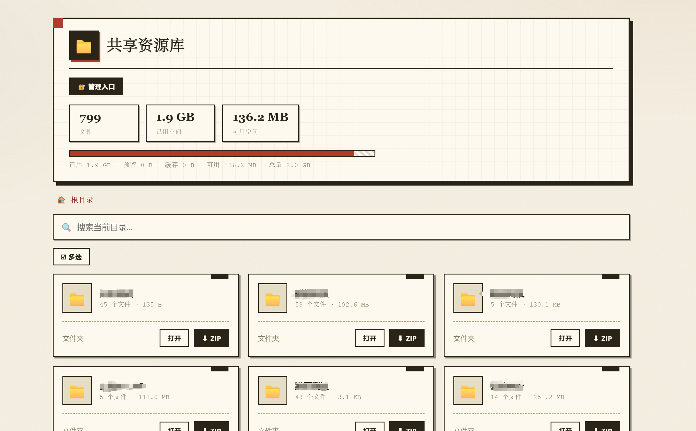

<div align="center">



# ShareHub · 共享资源站

**一个文件，跑起你的自托管资源分享站——管理员上传，访客免登录直接下载。**

Python 3 · 零第三方依赖 · MIT · Docker

[English](./README.en.md) · [部署方式](#快速开始) · [独特优势](#为什么是-sharehub) · [缓存与预留原理](#缓存与预留机制)

</div>

---

## 这是什么

ShareHub 是一个**轻量级自托管资源分享站**：管理员在网页里把文件/文件夹整理上传到一个目录树里，访客无需任何账号即可浏览和下载。

它不像重网盘那样需要多用户、同步客户端、数据库；也不像一次性分享工具那样传完即删。它只专注做一件事：**「管理员策划内容 → 访客直接下载」**——非常适合课程资料、调研素材、团队资源库、素材分发站等场景。

```
┌─────────────┐         ┌──────────────────┐         ┌─────────────────┐
│  管理员后台   │ ──上传──▶ │  文件池（目录树）  │ ──浏览──▶ │  公开只读前台     │
│  分片上传/管理 │         │  配额 / 缓存 / 预留 │         │  免登录下载       │
└─────────────┘         └──────────────────┘         └─────────────────┘
```

## 为什么是 ShareHub

### 🎯 目录上下文上传（独家）—— 可连续上传，绝不错放
在某个文件夹里点上传，文件**只会进这个文件夹**。上传进行中你切换到别的文件夹，**已入队的文件依然归原文件夹**，不会串目录。这意味着你可以一边传一边去整理别的文件夹——**连续上传互不干扰**。很多网盘软件做不到这一点（切文件夹后新上传会落到新文件夹）。

### ⚡ 分片并发上传
大文件按 **5MB 分片**，**3 路并发**上传，每片带 **SHA-256 完整性校验**。传输快，且不会被单次请求大小限制卡住。

### 🔁 断点续传 · 稳定传输
断网、关页面、取消后重新选择同一文件，**只补传缺失分片**，不重新传整个文件；≤64MB 的文件还能按内容哈希秒判"是否已传过"。配合目录上下文上传，就算中途切换目录，任务也稳定续传。

### 📂 文件夹机制
支持整文件夹拖拽/选择上传，**按文件大小升序排队**（小文件优先），重名文件夹自动合并（同名文件覆盖、新文件直接并入），文件夹内的文件依旧归该文件夹。

### ⚖️ 配额预留机制（几乎无同类）
在 **init 阶段就按"净增量"预留容量**（覆盖旧文件只算差值），而不是等到传完才发现超限。预留通过**三路释放**自动回收：取消即释放、空闲 2 分钟自动释放、关页立即释放（sendBeacon）。并发上传也不会超配。

### 📊 实时状态可视化
- **四段容量条**：已用 / 预留 / 缓存 / 可用，数字恒等加总
- **上传状态栏**：文件总数 / 已完成 / 上传中 / 等待 / 暂停 / 失败，实时统计卡
- **分页**：每页 12 张卡片，返回上一级占一个卡位；文件/任务列表都支持跳页

### 🛡️ 安全
HMAC 签名 Cookie + 滑动 7 天续期 + HttpOnly/SameSite；路径 realpath 防穿越；逐片哈希校验；所有管理接口强制登录。

### 🐍 单文件 · 零依赖
整个应用就是一个 `server.py`（约 110KB，Python 标准库），没有数据库、没有 Node、没有 PHP。任何装得上 Python 3 的机器都能跑，容器化也是自然的。

## 缓存与预留机制

**为什么有"缓存"？** 上传是分片的：分片先落盘到 `.uploads/` 暂存区，全部传完后合并成正式文件进入文件池。被取消或中断的分片不会立刻删除，而是作为**缓存**保留——这样再次上传同一文件时可以**断点续传**。缓存有 10 分钟 TTL 自动清理，也可以在后台"查看缓存 / 清理缓存"手动管理。

**为什么有"预留"？** 每个文件在 init 时就要通过容量校验。为防止多个并发上传同时通过校验、最终加起来超限，服务器会为通过校验的文件**预留**容量（覆盖旧文件只预留差值）。预留有三种释放路径：

| 场景 | 预留去向 |
|---|---|
| 上传完成 | 文件进入池，预留自动释放 |
| 点取消 | 立即释放预留，分片保留为缓存（可断点续传）|
| 页面关闭 | sendBeacon 立即释放 |
| 崩溃/断网 | 空闲 2 分钟自动释放；分片缓存保留至 10 分钟 TTL |

这样「可用空间」永远是准的，也不会出现传一半才发现装不下的情况。

## 与同类项目对比

| | **ShareHub** | 网盘 (Nextcloud/Cloudreve) | 文件管理器 (FileBrowser) | 一次性分享 (Jirafeau/MicroBin) |
|---|---|---|---|---|
| 定位 | 管理员策划 + 访客只读分发 | 个人存储/同步/协作 | 多用户文件管理 | 传完给链接 |
| 账号体系 | 单个管理员密码 | 多用户 | 多用户 | 无需 |
| 分片并发上传 | ✅ 3 并发 + 校验 | 部分 | 部分 | 少数 |
| 断点续传 | ✅ + 哈希续传 | 部分 | 部分 | 少数 |
| 目录上下文上传 | ✅ **独家** | ❌ 常串目录 | — | — |
| 配额预留机制 | ✅ 三路释放 | 简单超限拒绝 | 无 | 无 |
| 实时状态栏/容量条 | ✅ | 部分 | 少 | 无 |
| 部署 | 单文件/容器，零依赖 | 重（PHP/DB） | Go 单二进制 | 单文件 |
| 访客下载 | ✅ 免登录只读 | 需账号/链接 | 需账号 | 一次性链接 |

## 快速开始

### 方式一：直接运行（零依赖）

```bash
# 需要 Python 3.8+
python3 server.py --host 0.0.0.0 --port 18888 --prefix ""
```

然后访问：
- 前台（免登录下载）：`http://your-host:18888/`
- 后台：`http://your-host:18888/admin`（默认密码 `root`，登录后请立即修改）

> 路由是绝对路径；`--prefix` 只影响前端生成的链接。默认 `--prefix ""` 直接部署在根路径；经 nginx 部署在子路径（如 `/share`）时用 `--prefix /share`，见方式四。

### 方式二：Docker

```bash
docker run -d --name sharehub \
  -p 18888:18888 \
  -v $(pwd)/config.json:/app/config.json \
  -v $(pwd)/data/files:/app/files \
  -v $(pwd)/data/logs:/app/logs \
  sharehub/sharehub:latest
```

或用 docker-compose：

```bash
docker compose up -d
```

### 方式三：systemd（Linux 常驻）

```bash
sudo useradd -r -s /usr/sbin/nologin share
sudo mkdir -p /opt/share
sudo cp server.py config.json /opt/share/
sudo cp share.service /etc/systemd/system/
sudo systemctl daemon-reload && sudo systemctl enable --now share
```

### 方式四：nginx 反代（HTTPS + 子路径）

参考 `nginx.conf.example`。核心：`proxy_pass http://127.0.0.1:18888/;`（**末尾斜杠**会剥离 `/share` 前缀，后端路由是绝对路径），同时容器以 `--prefix /share` 启动。分片上传走分块请求，务必设置 `client_max_body_size 0`。

## 配置

`config.json`：

```json
{
  "admin_password_hash": "4813494d137e1631bba301d5acab6e7bb7aa74ce1185d456565ef51d737677b2",
  "quota": 10737418240
}
```

- `admin_password_hash`：管理员密码的 SHA-256。默认密码 `root`（对应上面的哈希）。
- `quota`：文件池总容量（字节），后台「⚖️ 修改容量」可在线调整（0.5GB ~ 200GB）。

## 使用

**后台**（需登录）：选择文件/文件夹上传、新建文件夹、多选打包 ZIP 下载/删除、查看缓存、清理缓存、查看日志、修改容量、修改密码。

**前台**（免登录）：浏览目录树、搜索当前目录、分页浏览、下载单个文件或打包 ZIP。

## Roadmap

- [ ] 分享链接（带有效期 / 密码 / 下载次数）
- [ ] 多管理员 / 角色
- [ ] 文件预览（图片 / 音视频 / 文档）
- [ ] 中英文界面切换
- [ ] 存储后端（本地目录 / S3 / 对象存储）

## License

[MIT](./LICENSE)
